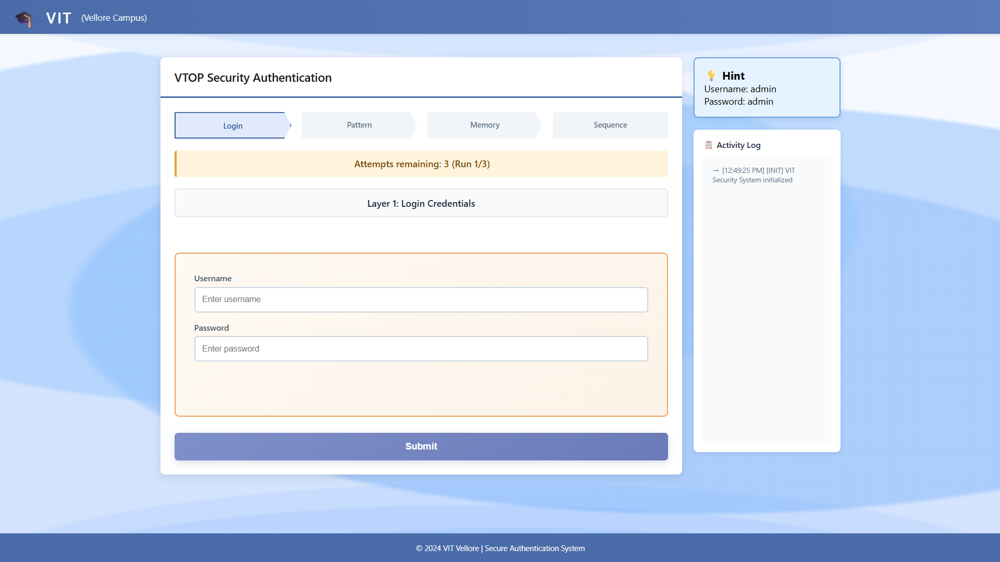
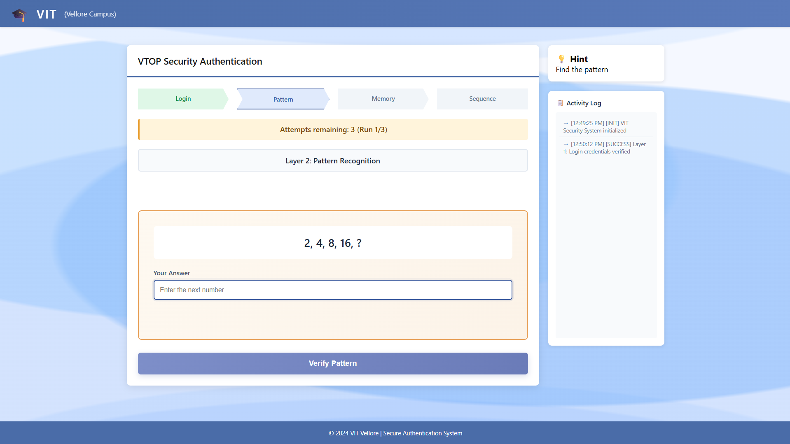
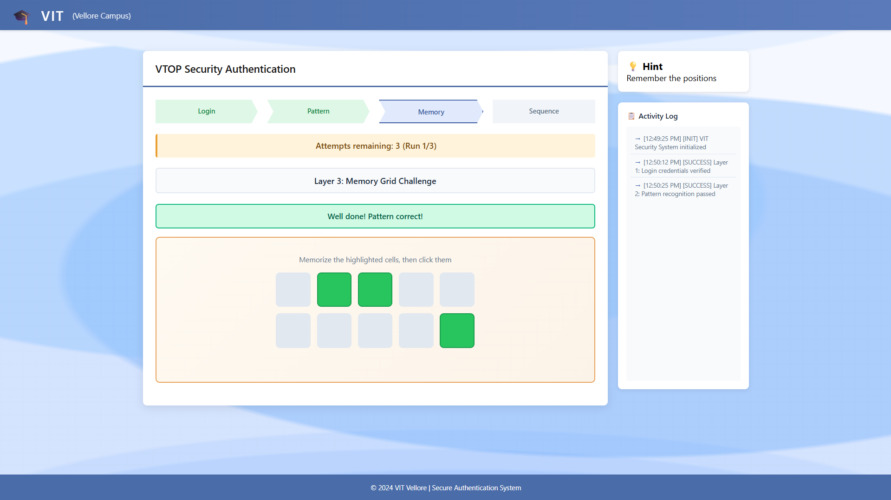
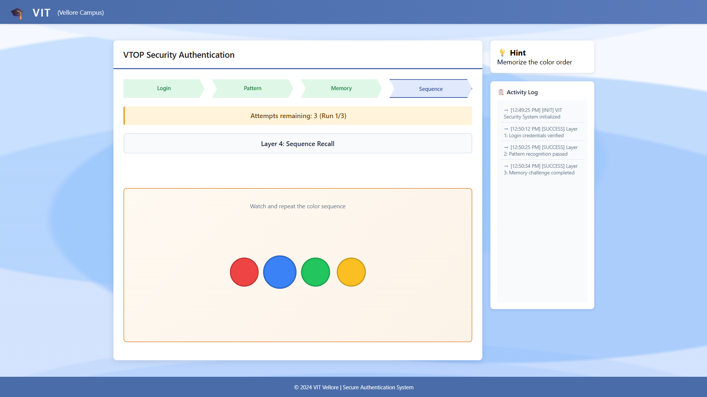
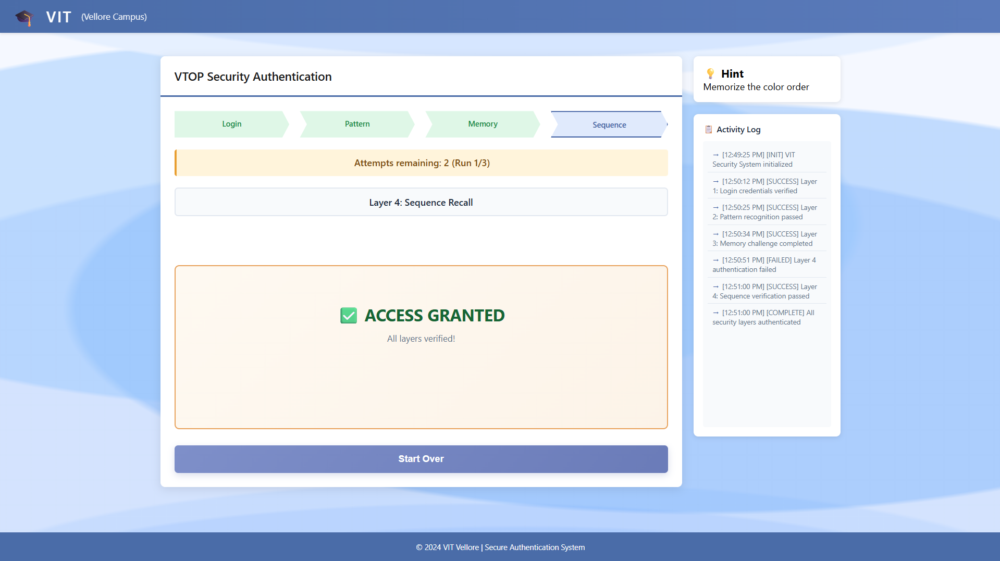

# 🔐 Multi-Layer Authentication System

A browser-based security demo featuring **4 progressive authentication layers** — combining traditional login, cognitive pattern recognition, visual memory, and color sequence recall.

> Built with vanilla HTML, CSS, and JavaScript — no frameworks, no dependencies.

---

## 🚀 Live Demo

**Click here: [Try it live →](https://vignesh-p-c.github.io/SecureStack-Multi-Layer-Web-Security-Lab/)**  *(deployed on GitHub Pages for free)*

---

## ✨ Features

| Layer | Type | Challenge |
|-------|------|-----------|
| 1 | Credential Auth | Username & password login |
| 2 | Pattern Recognition | Cognitive question challenges |
| 3 | Memory Grid | Visual cell memorization |
| 4 | Color Sequence | Color order recall |

- 🔒 **3 attempts per layer** before layer lockout
- 🚫 **3 total run attempts** before permanent session lockout
- 📋 **Real-time activity log** — every action is timestamped and recorded
- 📱 **Fully responsive** — works on mobile and desktop
- ⚡ **Zero dependencies** — pure vanilla JS, no npm install needed

---

## 🛠️ Tech Stack

- **HTML5** — Semantic markup, accessible structure
- **CSS3** — Grid layout, custom animations, responsive design
- **JavaScript (ES6)** — State machine, event-driven auth flow

---

## 📁 Project Structure

```
multi-layer-auth/
├── index.html      # App shell & all auth layer markup
├── styles.css      # Animations, grid, responsive styles
└── script.js       # Auth logic, state management, layer flow
```

---

## ⚙️ Getting Started

### Run Locally

```bash
# Clone the repo
git clone https://github.com/Vignesh-P-C/4-Layered-security-webApp.git
cd multi-layer-auth

# Just open in browser — no build step needed
open index.html
```

### Deploy to GitHub Pages (Free)

1. Push repo to GitHub
2. Go to **Settings → Pages**
3. Set source to `main` branch → `/ (root)`
4. Your live URL: `https://YOUR_USERNAME.github.io/multi-layer-auth`

---

## 🔧 Configuration

All config lives at the top of `script.js`:

```javascript
const CFG = {
  username: 'admin',      // Change for your demo
  password: 'admin',      // Change for your demo
  patterns: [
    { question: 'What is the first month of the year?', answer: 'january' },
    // Add your own pattern questions here
  ],
  sequences: [
    ['red', 'blue', 'green', 'yellow'],
    // Add your own color sequences here
  ]
};
```

---

## 🧠 How It Works

Authentication is handled as a **linear state machine** — each layer only activates after the previous one passes. Failed attempts decrement a counter; hitting zero locks that layer and burns one of three total session runs.

```
[Login] → [Pattern] → [Memory Grid] → [Color Sequence] → ✅ Authenticated
                ↓ (3 failed attempts)
           [Layer Lockout] → (3 total lockouts) → 🔒 Permanent Lockout
```

The activity log sidebar records every event with a timestamp so you can trace the full auth session.

---

## 🔮 Possible Improvements

- [ ] Add a backend (Node.js / Flask) to store credentials securely
- [ ] Hashed passwords instead of plaintext config
- [ ] Randomize pattern questions from a larger pool each session
- [ ] Add TOTP (Google Authenticator-style) as a 5th layer
- [ ] Persist lockout state in `localStorage` across page refreshes
- [ ] Add accessibility improvements (keyboard navigation, ARIA labels)

---

## 📸 Screenshots
Login Screen:


Pattern security:


Memory Grid:


Colour Sequence:


Successful Login:


---

## 📄 License

MIT — feel free to use, fork, and build on this.

---

*Made by Vignesh P C — [](https://github.com/Vignesh-P-C)*